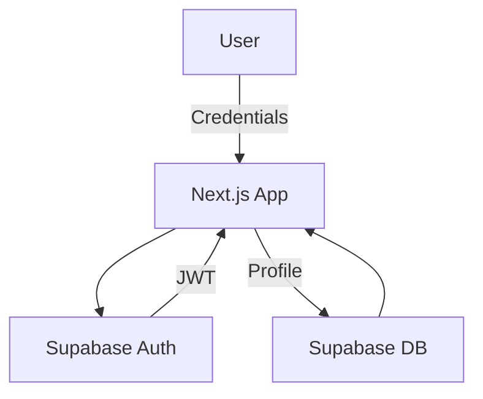

# Authentication Flow

This guide explains how user authentication works in News On Africa. The application uses **Supabase Auth** to handle account creation, login, and session management.

## Overview

1. A user chooses a sign-in method: email/password, Google, or Facebook.
2. The frontend sends the credentials or OAuth token to Supabase.
3. Supabase verifies the information and returns a session containing a JWT access token.
4. The Next.js app stores the session in an HTTP-only cookie and fetches the user's profile from the Supabase database.
5. On subsequent requests, the cookie is sent to Supabase to validate the user's identity.

## Flow Diagram

## Token Storage

- **HTTP-only Cookies**: Sessions are stored in secure, HTTP-only cookies to protect against XSS attacks.
- **Refresh Strategy**: The Supabase client automatically refreshes tokens before they expire.

## Signing Out

1. The user clicks **Sign out**.
2. The frontend calls `supabase.auth.signOut()`.
3. Supabase invalidates the session and the cookie is cleared.

## Error Handling

- **Invalid Credentials**: Display an error message and allow the user to retry.
- **Provider Errors**: If Google or Facebook authentication fails, show a generic error and log the detailed message for debugging.

## Additional Resources

For OAuth configuration steps, see [Supabase OAuth Configuration Guide](./supabase-oauth-setup.md).
